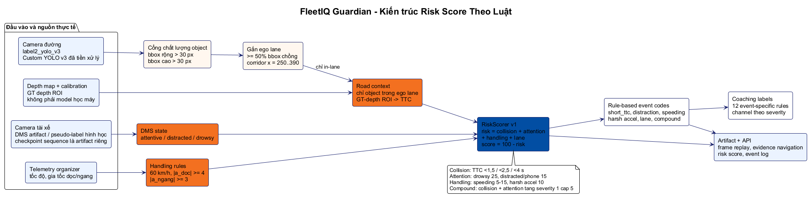

<div align="center">

# FleetIQ Guardian

**Remote driver intelligence and collision-risk evidence platform**

Challenge #3 submission for FPT Automotive Hackathon 2026

[Submission](#submission) | [Quick start](#quick-start) | [Evidence](#evidence) | [Release](#release) | [Documentation](#documentation)

</div>

FleetIQ Guardian helps a Fleet Safety Manager review a completed trip, inspect the
signals behind a risk event, and assign targeted coaching. Challenge #1 rule scoring
and Challenge #2 TTC/near-miss analysis are implemented as engines beneath the
Challenge #3 Driver Intelligence Platform.

## Evidence

The canonical walkthrough is T01d frame `1010`, produced by the full pipeline:

| Signal | Observed output | Source |
| --- | --- | --- |
| Road | In-lane `Car`, `20.40 m`, TTC `1.601 s`, confidence `0.8837` | `artifacts/trips/T01d/analysis/road/001010.json` |
| Driver state | `drowsy`, confidence `0.85` | `artifacts/trips/T01d/analysis/dms/001010.json` |
| Fusion | Risk `51.0`; `high_ttc_risk`, `driver_drowsiness`, `compound_risk` | `artifacts/trips/T01d/analysis/fusion/001010.json` |
| Submission output | `1010,50.500,1.601,drowsy,51.0` | `predictions/UchiHahaha/T01d.csv` |



> [!IMPORTANT]
> Trip safety scores are deterministic evidence scores. They are not fleet rankings,
> fleet averages, blind-test accuracy, or organizer evaluation results. TTC uses a
> GT-depth ROI for retained ego-corridor detections; the corridor is a filtering
> heuristic, not a calibrated lane model.

## Submission

| Deliverable | Location | Status |
| --- | --- | --- |
| Final report | [BTC template](docs/Automotive%20Hackthon%20-%20Final%20V%C3%B2ng%202.docx.md) | `v1.1.1`; contact and reviewer URLs still need final values |
| Final deck | [PPTX](docs/proposal/UchiHahaha_FleetIQGuardian_Final_Round2.pptx) and [PDF](docs/proposal/UchiHahaha_FleetIQGuardian_Final_Round2.pdf) | Reviewed 14-slide pair |
| Prediction CSVs | `predictions/UchiHahaha/T01d.csv` through `T10d.csv` | Ten files regenerated and validator-ready |
| Demo video | [Placeholder and edit map](docs/submission/DEMO_VIDEO_PLACEHOLDER.md) | Reserved filename: `FleetIQ_Guardian_Round2_Demo.mp4` |
| Private upload packet | `submission/UchiHahaha_FleetIQ_Guardian_Round2_Final_READY_FOR_UPLOAD.zip` | Local-only; refresh after adding the final MP4/URLs |

## Quick Start

Prerequisites: Python 3.12, `uv`, Node.js 22, pnpm 11, Docker Desktop, approved
organizer data, and the private runtime handoff when reviewing generated artifacts.

```powershell
uv sync --all-packages --group dev
pnpm install --frozen-lockfile
Copy-Item .env.example .env
docker compose --profile full up -d --build
```

Open <http://localhost:3000/trips/T01d>, select **Compound road and driver risk**
at frame `1010`, and verify the road overlay, DMS state, TTC, telemetry, and fusion
signals in the synchronized replay.

```powershell
curl.exe http://localhost:8000/api/v1/trips/T01d/analysis/fusion/summary
uv run python tools/dataset/validate_submission.py --predictions-dir predictions/UchiHahaha
```

## Release

`v1.1.1` is the final Round 2 source release. Public assets contain source,
documentation, and the final deck only. The private reviewer package contains local
models and generated evidence and must not be published without organizer approval.

```powershell
./tools/release/create_release_package.ps1 -Version v1.1.1 -PrivateReviewerHandoff
```

> [!CAUTION]
> Do not publish organizer data, model weights, generated trip media, prediction
> artifacts, or the private runtime ZIP without explicit organizer approval.

## Repository Layout

```text
apps/        Next.js dashboard, FastAPI, and CarSky integration surface
services/    Roadface, DMS, fusion, coaching, and event processing
packages/    Shared contracts, data access, model clients, and observability
ml/          Offline training and evaluation
tools/       Dataset, visualization, presentation, and release automation
docs/        Architecture, models, proposal, submission, demos, and runbooks
artifacts/   Ignored local models and generated evidence
```

## Quality Checks

```powershell
uv lock --check
uv run ruff check apps packages services ml infra tools
uv run pytest -q
pnpm --filter @fleetiq/web lint
pnpm --filter @fleetiq/web typecheck
pnpm --filter @fleetiq/web test
pnpm --filter @fleetiq/web build
uv run python tools/dataset/validate_submission.py --predictions-dir predictions/UchiHahaha
docker compose --profile full config
```

## Documentation

| Area | Purpose |
| --- | --- |
| [Submission](docs/submission/README.md) | Report, video placeholder, checklist, and upload packet guidance |
| [Proposal](docs/proposal/README.md) | Final judge-facing deck and export |
| [Model provenance](docs/models/PROVENANCE_FINAL.md) | Runtime role and claim boundaries |
| [Runbooks](docs/runbooks/README.md) | Regeneration, validation, and private handoff |
| [Architecture](docs/architecture/README.md) | System boundaries and rule diagrams |

## Team

UchiHahaha: Phi, Trung, Dung, Kha, and Tu.
