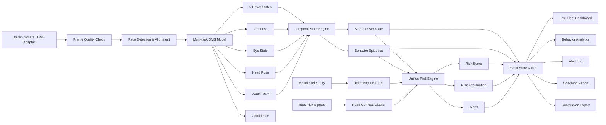

# Driver Intelligence Platform — Kế hoạch triển khai chi tiết
 
## 1. Phạm vi đề tài
 
Nhóm chỉ tập trung vào đề tài:
 
> **Driver Intelligence Platform — nền tảng giám sát, phân tích và quản trị rủi ro tài xế ở quy mô đội xe.**
 
Nền tảng hợp nhất tín hiệu Driver Monitoring System (DMS), telemetry của xe và road-risk context để giúp Fleet Manager:
 
- Biết tài xế nào đang mất tập trung, buồn ngủ hoặc có dấu hiệu microsleep.
- Theo dõi trạng thái tài xế theo thời gian thực.
- Phân tích xu hướng hành vi theo tài xế, chuyến đi, thời gian và tuyến đường.
- Nhận cảnh báo có bằng chứng khi hành vi nguy hiểm xảy ra.
- Hiểu vì sao một thời điểm hoặc chuyến đi có mức rủi ro cao.
- Tạo báo cáo coaching sau chuyến đi với ba vấn đề ưu tiên.
- Tích hợp dữ liệu và báo cáo qua API/email.
 
### 1.1. Các đầu ra bắt buộc
 
Theo `description.md`, sản phẩm cần có:
 
1. **Live Fleet Map Dashboard**
   - Trạng thái hiện tại của mỗi vehicle.
   - Màu marker theo risk level.
   - Có thể mở chi tiết tài xế/vehicle.
 
2. **Driver Behavior Analytics Panel**
   - Attention, drowsiness và distraction.
   - Phân tích theo driver, route và time.
 
3. **Unified Risk Score**
   - Risk per frame và per trip.
   - Kết hợp driver state, road risk và vehicle event.
   - Có breakdown giải thích.
 
4. **Fleet-level Alert Log**
   - Tổng hợp sự kiện nguy hiểm toàn fleet.
   - Filter, search, acknowledge và export.
 
5. **Automated Post-trip Coaching Report**
   - Ba điểm tài xế cần cải thiện.
   - Có evidence và recommendation.
   - Có thể gửi qua email/API.
 
6. **Integration Architecture Diagram**
   - DMS signals → processing pipeline → API/store → dashboard/report.
 
### 1.2. Những phần không phải trọng tâm
 
Nhóm không phát triển các challenge độc lập sau:
 
- Collision Risk Monitor như một bài toán TTC/AEB riêng.
- Fleet Safe Driving Score như một challenge scoring riêng.
 
TTC, headway, harsh behavior, speed và road event vẫn được dùng như **context input** cho Unified Risk Score, nhưng nhóm không dành phần lớn thời gian để xây một hệ thống collision prediction độc lập.
 
---
 
## 2. Mục tiêu sản phẩm
 
### 2.1. Người dùng mục tiêu
 
#### Fleet Manager
 
Cần:
 
- Xem toàn fleet trong một màn hình.
- Tìm vehicle/driver có rủi ro cao nhất.
- Xem alert và video evidence.
- So sánh hiệu suất giữa các driver.
- Xuất dữ liệu để review hoặc coaching.
 
#### Safety Coach
 
Cần:
 
- Xem các episode drowsy/distraction.
- Biết mức độ nghiêm trọng và thời lượng.
- Xem hành vi có trùng với road hazard hay không.
- Có báo cáo và recommendation rõ ràng.
 
#### OEM/System Integrator
 
Cần:
 
- API/data contract ổn định.
- Có thể thay custom DMS bằng DMS-01/DMS-04/DMS-08.
- Có confidence, quality flag và model version.
- Có kiến trúc modular.
 
### 2.2. Giá trị khác biệt
 
Sản phẩm không chỉ hiển thị nhãn `drowsy` hoặc `distracted`.
 
Điểm khác biệt cần thể hiện:
 
- Hợp nhất signal từ driver, road và vehicle.
- Chuyển prediction per-frame thành episode có ý nghĩa.
- Có explainable risk.
- Có workflow từ detection → alert → review → coaching.
- Có thể mở rộng từ một vehicle sang toàn fleet.
 
---
 
## 3. Kết quả audit dataset liên quan đến Driver Intelligence Platform
 
### 3.1. Tổng quan
 
| Dataset | Số trip hiện có | Frame/trip | Thời lượng | Driver label |
|---|---:|---:|---:|---|
| `Practice_Dataset` | 6 | 600 | 30 giây | Đầy đủ |
| `Hackathon_Dataset_Redacted` | 8 | 1.800 | 90 giây | Đã xóa |
 
Thông số:
 
- 20 FPS.
- Driver image 640×360.
- Mỗi frame có một ảnh driver.
- Practice có tổng cộng 3.600 labeled driver frame.
- Redacted hiện có tổng cộng 14.400 unlabeled driver frame.
 
### 3.2. Driver ground truth trong practice dataset
 
Mỗi practice frame có:
 
```text
driver.state
driver.alertness_score
driver.eye_state
driver.head_pose
driver.mouth_state
driver.nthu_subject_id
```
 
Các nhãn:
 
#### Driver state
 
```text
alert
drowsy
yawning
distracted
microsleep
```
 
#### Eye state
 
```text
open
partial
closed
```
 
#### Head pose
 
```text
normal
down
side
```
 
#### Mouth state
 
```text
normal
yawning
talking
```
 
#### Alertness
 
- Biến liên tục từ 0 đến 1.
- Giá trị cao tương ứng tỉnh táo hơn.
- Dùng cho analytics và risk fusion.
 
### 3.3. Phân bố driver state
 
| State | Số frame | Tỷ lệ |
|---|---:|---:|
| `alert` | 600 | 16,7% |
| `drowsy` | 900 | 25,0% |
| `yawning` | 600 | 16,7% |
| `distracted` | 900 | 25,0% |
| `microsleep` | 600 | 16,7% |
 
Tổng thể khá cân bằng. Tuy nhiên số frame không phản ánh độ đa dạng thực:
 
- Một số state chỉ xuất hiện ở một subject.
- Nhiều trip giữ nguyên một state suốt 30 giây.
- Một số trip chỉ đổi state đúng ở giây 15.
- Frame liên tiếp gần như giống nhau.
 
### 3.4. State timeline của practice trip
 
| Trip | Timeline |
|---|---|
| `T01-Sample` | distracted 0–15s → alert 15–30s |
| `T02-Sample` | drowsy toàn trip |
| `T03-Sample` | yawning toàn trip |
| `T04-Sample` | distracted 0–15s → alert 15–30s |
| `T05-Sample` | microsleep toàn trip |
| `T06-Sample` | drowsy 0–15s → distracted 15–30s |
 
Hệ quả:
 
- Random frame split sẽ cho validation score cao giả.
- Model có thể nhớ subject/background thay vì học mắt, miệng và head pose.
- Validation chính phải group theo trip hoặc subject.
- Cần temporal evaluation, không chỉ per-frame accuracy.
 
### 3.5. Redacted dataset
 
Redacted trip:
 
- Có đầy đủ 1.800 driver image/trip.
- Không có driver state.
- Không có alertness.
- Không có eye/head/mouth labels.
- Không có subject ID.
 
Vì vậy:
 
- Dùng practice để train/evaluate.
- Chạy inference trên redacted để sinh submission và demo.
- Không dùng prediction trên redacted như ground truth để tự đánh giá.
 
### 3.6. Các vấn đề dữ liệu cần xử lý
 
#### Thiếu trip
 
Starter-kit mô tả 10 scored trip từ `T01d` đến `T10d`, nhưng workspace hiện chỉ có `T01d` đến `T08d`.
 
Cần xin lại:
 
```text
T09d
T10d
```
 
#### `T08d`
 
`T08d` thiếu nhiều road-camera/label file, nhưng **driver camera vẫn đủ 1.800 frame**.
 
Kết luận cho đề tài này:
 
- DMS inference trên `T08d` vẫn làm được.
- Vehicle-detail road video sẽ không đầy đủ.
- Unified risk cần missing-road-data flag và fallback.
 
#### Mapping file
 
Tài liệu nhắc đến driver mapping file, nhưng workspace hiện không có mapping file. `driver.state` và `nthu_subject_id` vẫn nằm trực tiếp trong practice JSON nên vẫn có thể tạo training index.
 
### 3.7. Environment
 
`.venv` dùng Python 3.12 và đã được cài các dependency của starter-kit bằng:
 
```bash
uv pip install --python .venv/bin/python -r package_starterkit/requirements.txt
```
 
NumPy, Pandas, OpenCV, Matplotlib và Jupyter hiện hoạt động.
 
---
 
## 4. Tiêu chí chấm liên quan trực tiếp đến đề tài
 
Theo evaluator hiện tại, Driver Intelligence Platform được chấm bằng:
 
```text
predicted_driver_state
```
 
Metric:
 
```text
composite = 50% × accuracy + 50% × macro-F1
```
 
Macro-F1 chỉ tính trên các class thật sự xuất hiện trong từng trip.
 
### 4.1. Submission tối thiểu
 
Nếu chỉ tham gia Driver Intelligence Platform, CSV có thể chỉ chứa:
 
```csv
frame_id,timestamp,predicted_driver_state
0,0.000,alert
1,0.050,alert
```
 
Không cần thêm `predicted_ttc` hoặc `predicted_risk_score` để làm Challenge 2.
 
State hợp lệ:
 
```text
alert
drowsy
yawning
distracted
microsleep
```
 
### 4.2. Alertness và auxiliary signals
 
Evaluator không chấm:
 
- Alertness regression.
- Eye state.
- Head pose.
- Mouth state.
 
Nhưng các output này vẫn rất quan trọng vì:
 
- Giúp multi-task model generalize tốt hơn.
- Làm dashboard giàu thông tin.
- Tạo risk explanation.
- Phân biệt drowsy/yawning/microsleep.
- Tạo coaching recommendation cụ thể.
 
---
 
## 5. Kiến trúc hệ thống
 

 
### 5.1. Modular DMS adapter
 
Hệ thống cần hỗ trợ:
 
- Custom model của nhóm.
- Output từ DMS-01.
- Output từ DMS-04.
- Output từ DMS-08.
 
Mọi nguồn DMS phải được normalize về cùng schema:
 
```json
{
  "timestamp": 12.35,
  "frame_id": 247,
  "state": "drowsy",
  "state_probabilities": {
    "alert": 0.04,
    "drowsy": 0.82,
    "yawning": 0.05,
    "distracted": 0.03,
    "microsleep": 0.06
  },
  "alertness_score": 0.31,
  "eye_state": "partial",
  "head_pose": "normal",
  "mouth_state": "normal",
  "confidence": 0.82,
  "face_quality": 0.91,
  "model_version": "dms-v1"
}
```
 
---
 
## 6. Canonical platform data contract
 
```json
{
  "trip_id": "T01d",
  "vehicle_id": "VEH-001",
  "driver_id": "DRV-001",
  "frame_id": 247,
  "timestamp": 12.35,
  "location": {
    "lat": 10.776,
    "lon": 106.700,
    "synthetic": true
  },
  "driver": {
    "state": "drowsy",
    "confidence": 0.82,
    "alertness_score": 0.31,
    "eye_state": "partial",
    "head_pose": "normal",
    "mouth_state": "normal",
    "face_detected": true,
    "quality": 0.91
  },
  "vehicle": {
    "speed_kmh": 64.2,
    "speed_limit_kmh": 60.0,
    "longitudinal_accel": -1.4,
    "lateral_accel": 0.3
  },
  "road_context": {
    "min_ttc": 2.1,
    "headway_sec": 1.4,
    "hazard_type": "lead_brake",
    "available": true
  },
  "risk": {
    "score": 72.0,
    "level": "high",
    "contributors": [
      {
        "signal": "driver_drowsy",
        "contribution": 31.0
      },
      {
        "signal": "low_alertness",
        "contribution": 22.0
      },
      {
        "signal": "road_ttc",
        "contribution": 19.0
      }
    ]
  }
}
```
 
Risk level đề xuất:
 
| Risk score | Level | Màu |
|---:|---|---|
| 0–29 | Low | Xanh |
| 30–59 | Medium | Vàng |
| 60–79 | High | Cam |
| 80–100 | Critical | Đỏ |
 
---
 
## 7. Workstream A — Data preparation cho DMS
 
### 7.1. Training index
 
Tạo một file index:
 
```csv
trip_id,frame_id,timestamp,image_path,subject_id,state,alertness_score,eye_state,head_pose,mouth_state
```
 
Mỗi dòng tương ứng một frame practice.
 
### 7.2. Data audit
 
Kiểm tra:
 
- Ảnh tồn tại và đọc được.
- Kích thước đúng.
- Label thuộc enum hợp lệ.
- Timestamp tăng đều.
- `frame_id` không trùng.
- Subject/trip mapping.
- Class distribution.
- State transition.
- Duplicate/near-duplicate frame.
 
### 7.3. Sampling
 
20 FPS tạo ra rất nhiều frame gần giống nhau. Chiến lược:
 
- Train MVP ở 5–10 FPS.
- Giữ 20 FPS cho inference/submission.
- Không lấy liên tiếp quá nhiều frame giống hệt trong một batch.
- Cân bằng theo class và trip, không chỉ theo số frame.
 
### 7.4. Data split
 
Ưu tiên:
 
1. Leave-one-trip-out.
2. GroupKFold theo subject.
3. Train trên năm trip, validate trên một trip.
 
Không dùng random frame split làm metric chính.
 
### 7.5. Augmentation
 
Nên dùng:
 
- Brightness/contrast.
- Gamma.
- Motion blur nhẹ.
- JPEG compression.
- Resize/crop.
- Small rotation.
- Random occlusion nhẹ.
 
Cần thận trọng với:
 
- Horizontal flip khi học head direction.
- Crop quá sát làm mất tay/điện thoại hoặc body pose.
- Color augmentation quá mạnh làm ảnh không thực tế.
 
### 7.6. Acceptance criteria
 
- Có index cho đủ 3.600 practice frame.
- Không có broken image.
- Có report phân bố class/subject/trip.
- Split được lưu thành file để mọi experiment dùng giống nhau.
 
---
 
## 8. Workstream B — DMS model
 
### 8.1. Baseline nhanh
 
Backbone:
 
- MobileNetV3-Small/Large; hoặc
- EfficientNet-B0; hoặc
- ResNet18.
 
Ưu tiên model nhỏ vì:
 
- Dễ train.
- Inference nhanh.
- Phù hợp live dashboard.
- Dataset nhỏ, model lớn dễ overfit.
 
### 8.2. Input strategy
 
Thử hai cấu hình:
 
#### Full cabin frame
 
Ưu điểm:
 
- Thấy body pose, tay và hướng nhìn tổng thể.
- Có thể phát hiện distraction ngoài khuôn mặt.
 
Nhược điểm:
 
- Background và subject identity dễ gây overfit.
 
#### Face/upper-body crop
 
Ưu điểm:
 
- Tập trung mắt, miệng và head pose.
- Giảm ảnh hưởng background.
 
Nhược điểm:
 
- Có thể mất dấu hiệu distraction từ tay/thiết bị.
 
Đề xuất:
 
- MVP dùng face/upper-body crop.
- Nếu đủ thời gian, fusion hai crop:
  - Face branch.
  - Full-frame branch.
 
### 8.3. Multi-task output
 
Shared backbone với các head:
 
1. Driver state: 5 class.
2. Alertness regression.
3. Eye state.
4. Head pose.
5. Mouth state.
 
Loss gợi ý:
 
```text
total_loss =
    1.0 × state_cross_entropy
  + 0.5 × alertness_loss
  + 0.2 × eye_loss
  + 0.2 × head_pose_loss
  + 0.2 × mouth_loss
```
 
Alertness loss:
 
- Smooth L1 hoặc MSE.
 
State loss:
 
- Cross entropy.
- Có thể thêm label smoothing nhỏ.
 
### 8.4. Feature reasoning
 
Model cần học:
 
| State | Visual cues kỳ vọng |
|---|---|
| Alert | mắt mở, head normal, alertness cao |
| Drowsy | mắt partial/closed kéo dài, alertness thấp |
| Yawning | mouth yawning |
| Distracted | head side/down, attention lệch |
| Microsleep | mắt closed kéo dài, alertness rất thấp |
 
Multi-task learning giúp model dùng đúng cue thay vì nhớ subject.
 
### 8.5. Training stages
 
#### Stage 1
 
- Freeze backbone.
- Train classifier heads.
- Learning rate cao hơn cho head.
 
#### Stage 2
 
- Unfreeze block cuối.
- Learning rate thấp.
- Early stopping theo grouped validation macro-F1.
 
#### Stage 3
 
- Tune temporal smoothing.
- Không tune smoothing trực tiếp trên scored/redacted trip.
 
### 8.6. Metric
 
Lưu:
 
- Accuracy.
- Macro-F1.
- Per-class precision/recall/F1.
- Confusion matrix.
- Alertness MAE.
- Eye/head/mouth accuracy.
- Inference time/frame.
 
Metric chính:
 
```text
50% × accuracy + 50% × macro-F1
```
 
### 8.7. Rủi ro overfit
 
Nguyên nhân:
 
- Chỉ sáu practice trip.
- Subject tương quan với state.
- Frame liên tiếp gần giống nhau.
 
Giảm thiểu:
 
- Group split.
- Pretrained backbone.
- Freeze phần lớn backbone.
- Multi-task labels.
- Face/upper-body crop.
- Regularization.
- Temporal sampling.
- Nếu luật cho phép, pretrain bằng DMD gốc hoặc dataset DMS bổ sung.
 
### 8.8. Acceptance criteria
 
- Sinh đủ năm state.
- Không có output ngoài enum.
- Có grouped validation report.
- Có model version/config.
- Có batch inference cho cả trip.
- Có confidence per frame.
 
---
 
## 9. Workstream C — Temporal Driver State Engine
 
### 9.1. Lý do cần temporal engine
 
DMS raw prediction có thể:
 
- Nhảy state chỉ trong một frame.
- Nhầm yawning/drowsy.
- Nhầm drowsy/microsleep.
- Mất face detection tạm thời.
 
Fleet Manager cần episode ổn định, không cần nhãn nhấp nháy 20 lần/giây.
 
### 9.2. Probability smoothing
 
EMA:
 
```text
smoothed_probability[t] =
    alpha × raw_probability[t]
  + (1 - alpha) × smoothed_probability[t - 1]
```
 
Khởi đầu:
 
```text
alpha = 0.2
```
 
### 9.3. Hysteresis
 
Chỉ đổi state khi:
 
- State mới có confidence vượt threshold.
- State mới thắng liên tiếp N frame.
- Hoặc state mới là critical như microsleep với confidence rất cao.
 
Ví dụ:
 
```text
normal state change: 10 frames
critical state change: 3 frames
recovery to alert: 20 frames
```
 
Recovery chậm hơn activation để tránh alert đóng/mở liên tục.
 
### 9.4. Missing-face policy
 
Khi không phát hiện mặt:
 
- Dưới 0,5 giây: giữ state cũ, giảm confidence.
- 0,5–2 giây: state `unknown` nội bộ, tạo quality warning.
- Trên 2 giây: tạo sensor/face-unavailable episode.
 
`unknown` chỉ dùng nội bộ. Khi xuất submission, cần fallback về state hợp lệ gần nhất hoặc class có xác suất cao nhất.
 
### 9.5. Episode extraction
 
Chuyển per-frame state thành:
 
```json
{
  "type": "drowsy",
  "start_time": 12.5,
  "end_time": 21.8,
  "duration_sec": 9.3,
  "peak_confidence": 0.94,
  "minimum_alertness": 0.18,
  "evidence_frame_id": 376
}
```
 
### 9.6. Episode merge
 
- Hai episode cùng type cách nhau dưới 1–2 giây được merge.
- Gap do mất face ngắn không nên tách episode.
- Evidence frame là frame có confidence cao nhất hoặc alertness thấp nhất.
 
### 9.7. Acceptance criteria
 
- Dashboard state ổn định.
- Không spam alert theo frame.
- Episode có start/end/duration/evidence.
- Smoothing không làm chậm critical alert quá mức.
 
---
 
## 10. Workstream D — Driver Behavior Analytics
 
### 10.1. Chỉ số per trip
 
- Thời gian theo từng state.
- Tỷ lệ theo từng state.
- Average/minimum alertness.
- Longest drowsy episode.
- Microsleep count.
- Distraction episode count.
- Yawning count/duration.
- Time to first fatigue event.
- Driver risk exposure.
 
### 10.2. Chỉ số per driver
 
- Tổng số trip.
- Tổng driving time.
- Drowsiness rate.
- Distraction rate.
- Microsleep rate.
- Alertness trend.
- Behavior trend theo ngày/giờ.
- Top recurring issue.
- Coaching completion/status.
 
### 10.3. Chỉ số fleet-level
 
- Driver đang high/critical risk.
- Tỷ lệ fleet đang alert/drowsy/distracted.
- Alert count theo giờ.
- Top risky drivers.
- Top risky routes.
- Fatigue hotspot theo time-of-day.
- Trend tuần/tháng.
 
### 10.4. Phân tích theo route/time
 
Redacted dataset không còn geolocation thật. Demo có thể:
 
- Dùng practice geolocation; hoặc
- Dùng synthetic route; hoặc
- Gán route ID theo trip/map.
 
Phải có field:
 
```text
location.synthetic = true/false
```
 
Không trộn route giả với GPS thật mà không đánh dấu.
 
### 10.5. Analytics chart
 
- Stacked area: state theo thời gian.
- Line chart: alertness.
- Heatmap: drowsy/distraction theo giờ.
- Bar chart: state distribution.
- Episode timeline.
- Driver leaderboard.
- Route risk comparison.
 
### 10.6. Acceptance criteria
 
- Filter theo driver/trip/time.
- Metric tính từ episode, không đếm từng frame như một sự kiện.
- Click từ chart về đúng evidence timestamp.
- Không dùng scored prediction làm ground truth để báo cáo model accuracy.
 
---
 
## 11. Workstream E — Unified Driver Risk Intelligence
 
### 11.1. Mục tiêu
 
Risk score không chỉ trả lời:
 
> Tài xế đang ở state gì?
 
Mà phải trả lời:
 
> Trạng thái này nguy hiểm đến mức nào trong bối cảnh xe và đường hiện tại?
 
Ví dụ:
 
- Drowsy khi xe đứng yên có risk thấp hơn.
- Drowsy ở tốc độ cao có risk cao hơn.
- Distracted đồng thời TTC thấp phải nâng lên critical.
- Microsleep luôn cần phản ứng nhanh.
 
### 11.2. Driver factors tìm được từ dataset
 
Practice ground truth dùng:
 
```text
final_risk_score = min(100, base_risk × driver_factor)
```
 
| Driver state | Factor |
|---|---:|
| `alert` | 1,0 |
| `yawning` | 1,5 |
| `drowsy` | 2,0 |
| `distracted` | 2,2 |
| `microsleep` | 3,5 |
 
Công thức đúng trên toàn bộ 3.600 practice frame.
 
### 11.3. Risk feature
 
#### Driver
 
- State probability.
- Alertness.
- Eye closure.
- Head pose.
- Mouth/yawning.
- Episode duration.
- Prediction confidence.
 
#### Vehicle
 
- Speed.
- Speed over limit.
- Longitudinal acceleration.
- Lateral acceleration.
- Harsh-event flags.
 
#### Road context
 
- TTC nếu có.
- Headway nếu có.
- Event type.
- Rain/fog/night.
- Road data availability.
 
### 11.4. Rule-based MVP
 
Ví dụ:
 
```text
driver_risk =
    state_base_score
  + low_alertness_penalty
  + duration_penalty
 
context_multiplier =
    speed_factor
  × road_hazard_factor
  × weather_factor
 
final_risk =
    clamp(driver_risk × context_multiplier + vehicle_event_penalty, 0, 100)
```
 
State base score gợi ý ban đầu:
 
| State | Base score |
|---|---:|
| Alert | 5 |
| Yawning | 30 |
| Drowsy | 45 |
| Distracted | 50 |
| Microsleep | 85 |
 
Đây chỉ là điểm khởi đầu. Cần hiệu chỉnh bằng practice risk ground truth và demo expectation.
 
### 11.5. ML risk fusion
 
Nếu đủ thời gian:
 
- Train tree model nhỏ.
- Target: practice `final_risk_score`.
- Input: output dự đoán DMS + telemetry + road context.
- Dùng grouped validation theo trip.
 
Lưu ý quan trọng:
 
- Không train bằng ground-truth driver state rồi inference bằng predicted state mà không kiểm tra distribution shift.
- Tốt nhất dùng out-of-fold DMS prediction làm feature train risk model.
 
### 11.6. Explainability
 
Hai chế độ:
 
#### Rule contribution
 
Nếu dùng rule-based engine:
 
```text
Risk 78/100
+32 distracted
+18 distraction kéo dài 12 giây
+16 tốc độ cao
+12 TTC thấp
```
 
Gọi đúng là `rule contribution`, không gọi là SHAP.
 
#### SHAP
 
Nếu dùng tree model:
 
- Dùng TreeSHAP.
- Hiển thị top contribution.
- Map technical feature sang tên dễ hiểu.
 
### 11.7. Acceptance criteria
 
- Score luôn 0–100.
- Risk level nhất quán trên map, alert và report.
- High/critical risk có explanation.
- Engine vẫn chạy nếu thiếu road data.
- Không hiển thị SHAP giả cho rule-based model.
 
---
 
## 12. Workstream F — Fleet Alert Engine
 
### 12.1. Alert type
 
Trọng tâm driver:
 
- Drowsiness.
- Prolonged drowsiness.
- Microsleep.
- Distraction.
- Prolonged distraction.
- Yawning/fatigue.
- Low alertness.
- Face/camera unavailable.
 
Contextual alert:
 
- Drowsy + high speed.
- Distracted + low TTC.
- Microsleep + vehicle moving.
- Multiple driver-risk signals.
 
### 12.2. Severity
 
| Condition | Severity gợi ý |
|---|---|
| Yawning ngắn | Low |
| Drowsy ngắn, tốc độ thấp | Medium |
| Distracted kéo dài | High |
| Drowsy + high speed | High |
| Microsleep | Critical |
| Microsleep + road hazard | Critical |
 
### 12.3. Alert record
 
```json
{
  "alert_id": "ALT-000123",
  "vehicle_id": "VEH-001",
  "driver_id": "DRV-001",
  "trip_id": "T01d",
  "type": "driver_drowsiness",
  "severity": "high",
  "start_time": 12.5,
  "end_time": 21.8,
  "duration_sec": 9.3,
  "peak_risk": 78,
  "minimum_alertness": 0.18,
  "evidence_frame_id": 376,
  "status": "new"
}
```
 
### 12.4. Deduplication
 
- Không tạo một alert mỗi frame.
- Merge episode cùng type.
- Alert chỉ đóng sau khi signal safe đủ lâu.
- Một combined risk alert có thể liên kết các driver/road event con.
 
### 12.5. Acceptance criteria
 
- Không spam.
- Có start/end.
- Có severity và evidence.
- Có acknowledge workflow.
- Có filter/export.
 
---
 
## 13. Workstream G — Automated Coaching Report
 
### 13.1. Mục tiêu
 
Sau mỗi trip, report phải trả lời:
 
- Tài xế làm tốt gì?
- Ba vấn đề nào cần ưu tiên?
- Mỗi vấn đề xảy ra khi nào?
- Mức độ nghiêm trọng ra sao?
- Tài xế nên thay đổi hành vi gì?
 
### 13.2. Aggregation
 
Tính:
 
- Tổng duration theo behavior.
- Số episode.
- Longest episode.
- Peak severity.
- Minimum alertness.
- Tỷ lệ trùng với vehicle/road risk.
- Recurrence.
 
### 13.3. Priority formula
 
```text
priority =
    severity_weight
  × log(1 + duration_sec)
  × confidence
  × recurrence_factor
  × context_factor
```
 
### 13.4. Ba improvement areas
 
Ví dụ:
 
1. **Giảm mất tập trung**
   - 3 episode.
   - Tổng 42 giây.
   - Episode nghiêm trọng nhất tại 00:45.
   - Trùng với vehicle đang chạy tốc độ cao.
 
2. **Quản lý dấu hiệu buồn ngủ**
   - Alertness trung bình thấp.
   - Drowsy episode dài nhất 18 giây.
   - Khuyến nghị nghỉ ngắn trước trip dài.
 
3. **Phản ứng sớm với fatigue**
   - 4 yawning episode trước drowsiness.
   - Khuyến nghị coi yawning lặp lại là early warning.
 
### 13.5. Report format
 
- HTML là bắt buộc cho MVP.
- PDF nếu còn thời gian.
- JSON API cho tích hợp.
- Evidence thumbnail.
- Timeline.
- Summary card.
- Three recommendations.
 
### 13.6. Text generation
 
MVP dùng template deterministic:
 
- Không cần API key.
- Không hallucinate.
- Mọi claim truy ngược được về dữ liệu.
 
LLM chỉ dùng để viết lại câu chữ sau khi statistic đã được tính.
 
### 13.7. Acceptance criteria
 
- Có đúng ba ưu tiên nếu đủ episode.
- Mọi claim có timestamp/evidence.
- Có thể download.
- Send API không làm crash khi thiếu email credential.
 
---
 
## 14. Workstream H — Simulator và backend
 
### 14.1. Fleet simulator
 
Replay nhiều trip như nhiều vehicle:
 
- Offset thời điểm bắt đầu.
- Tốc độ 0,5×, 1×, 2×.
- Pause/resume/seek.
- Synthetic route cho map.
- Precomputed DMS output để demo ổn định.
 
Khuyến nghị:
 
- Precompute inference cho toàn bộ trip.
- Dashboard live chỉ đọc cache.
- Có một chế độ live inference riêng để chứng minh model hoạt động.
 
### 14.2. Backend
 
MVP:
 
- FastAPI.
- WebSocket.
- SQLite hoặc DuckDB.
- Evidence/report lưu theo file path.
 
Không cần Kafka/Kubernetes cho bản hackathon.
 
### 14.3. API
 
#### Fleet
 
```text
GET /api/fleet/vehicles
GET /api/fleet/summary
GET /api/vehicles/{vehicle_id}
```
 
#### Driver
 
```text
GET /api/drivers
GET /api/drivers/{driver_id}
GET /api/drivers/{driver_id}/analytics
```
 
#### Trip
 
```text
GET /api/trips
GET /api/trips/{trip_id}
GET /api/trips/{trip_id}/timeline
GET /api/trips/{trip_id}/episodes
GET /api/trips/{trip_id}/report
```
 
#### Alerts
 
```text
GET  /api/alerts
GET  /api/alerts/{alert_id}
POST /api/alerts/{alert_id}/acknowledge
GET  /api/alerts/export.csv
```
 
#### Reports
 
```text
POST /api/trips/{trip_id}/coaching-report
POST /api/reports/{report_id}/send
```
 
#### Streaming
 
```text
WS /ws/fleet
WS /ws/vehicles/{vehicle_id}
```
 
### 14.4. Storage
 
Tables:
 
- `vehicles`
- `drivers`
- `trips`
- `driver_frame_states`
- `behavior_episodes`
- `risk_scores`
- `alerts`
- `coaching_reports`
 
### 14.5. Acceptance criteria
 
- Replay ít nhất ba vehicle.
- Dashboard update 5–10 Hz.
- Refresh trang không làm mất alert.
- Có WebSocket reconnect.
- Trip history đọc được qua REST.
 
---
 
## 15. Workstream I — Unified Dashboard
 
### 15.1. Live Fleet Monitor
 
Hiển thị:
 
- Fleet map.
- Vehicle marker theo risk.
- Driver state badge.
- Fleet summary.
- Danh sách high-risk vehicle.
 
Summary:
 
- Active vehicle.
- Alert driver.
- Drowsy driver.
- Distracted driver.
- Critical alerts.
 
### 15.2. Vehicle/Driver detail
 
- Driver-facing video.
- Road-facing video nếu có.
- Current state.
- State confidence.
- Alertness.
- Eye/head/mouth.
- Speed.
- Road context.
- Unified risk gauge.
- Risk explanation.
- Synchronized timeline.
 
### 15.3. Behavior Analytics
 
Filter:
 
- Driver.
- Vehicle.
- Trip.
- Route.
- Time range.
- State.
- Severity.
 
Chart:
 
- State distribution.
- Alertness timeline.
- Drowsy/distraction episode timeline.
- Heatmap theo giờ.
- Driver comparison.
- Risk trend.
 
### 15.4. Alert Log
 
Cột:
 
- Timestamp.
- Driver.
- Vehicle.
- State/event.
- Severity.
- Duration.
- Risk.
- Status.
 
Tính năng:
 
- Filter.
- Search.
- Sort.
- Acknowledge.
- Export.
- Open evidence.
 
### 15.5. Coaching Report
 
- Trip summary.
- State distribution.
- Risk timeline.
- Top three improvement areas.
- Evidence.
- Download/send.
 
### 15.6. Update rate
 
- Driver state: 5–10 Hz trên UI.
- Video: theo nguồn, tối đa 20 FPS.
- Charts: 1 Hz hoặc theo batch.
- Map: 2–5 Hz.
 
Không render lại toàn bộ dashboard 20 lần/giây.
 
### 15.7. Acceptance criteria
 
- Tìm được driver nguy hiểm nhất trong dưới 5 giây.
- Từ map đến evidence không quá hai click.
- State/risk color nhất quán.
- Video và timeline đồng bộ.
- Có loading/empty/error state.
 
---
 
## 16. Submission pipeline cho Driver Intelligence Platform
 
### 16.1. Output
 
Mỗi scored trip:
 
```csv
frame_id,timestamp,predicted_driver_state
0,0.000,alert
1,0.050,alert
```
 
### 16.2. Quy tắc
 
- Tên file phải đúng trip ID, ví dụ `T01d.csv`.
- Có đúng 1.800 row cho scored trip.
- `frame_id` từ 0 đến 1.799.
- Không trùng/thiếu frame.
- Timestamp đúng.
- State đúng enum.
- Không để blank.
 
### 16.3. Submission validator
 
Kiểm tra:
 
- Filename.
- Header.
- Row count.
- Duplicate frame.
- Missing frame.
- Invalid state.
- Blank/NaN.
- Timestamp lệch.
 
### 16.4. Acceptance criteria
 
- Mọi practice CSV chạy qua local evaluator.
- Mọi scored CSV pass validator.
- Có thể sinh toàn bộ CSV bằng một command.
- Prediction deterministic.
 
---
 
## 17. Testing và evaluation
 
### 17.1. Model test
 
- Accuracy.
- Macro-F1.
- Per-class F1.
- Confusion matrix.
- Alertness MAE.
- Inference latency.
 
### 17.2. Temporal test
 
- State transition count.
- Detection delay.
- Recovery delay.
- Episode precision.
- Alert spam rate.
 
### 17.3. Data test
 
- Driver image existence.
- JSON schema.
- Label enum.
- Timestamp.
- Frame count.
- Trip/subject split integrity.
 
### 17.4. Platform test
 
- Replay → inference cache → WebSocket → dashboard.
- State update.
- Episode creation.
- Risk update.
- Alert creation/merge.
- Coaching report.
- CSV export.
 
### 17.5. Failure test
 
- Missing driver frame.
- Face không phát hiện.
- Model lỗi.
- Missing road context.
- WebSocket disconnect.
- Email chưa cấu hình.
- Corrupt prediction cache.
 
---
 
## 18. Cấu trúc source code đề xuất
 
```text
hkt/
├── description.md
├── HACKATHON_PLAN.md
├── Practice_Dataset/
├── Hackathon_Dataset_Redacted/
├── package_starterkit/
├── configs/
│   ├── dms.yaml
│   ├── temporal.yaml
│   ├── risk.yaml
│   └── app.yaml
├── src/
│   ├── data/
│   │   ├── audit.py
│   │   ├── driver_index.py
│   │   └── schemas.py
│   ├── dms/
│   │   ├── dataset.py
│   │   ├── preprocessing.py
│   │   ├── model.py
│   │   ├── train.py
│   │   ├── infer.py
│   │   └── temporal.py
│   ├── behavior/
│   │   ├── episodes.py
│   │   └── analytics.py
│   ├── risk/
│   │   ├── rules.py
│   │   ├── model.py
│   │   └── explain.py
│   ├── alerts/
│   │   ├── engine.py
│   │   └── schemas.py
│   ├── coaching/
│   │   ├── aggregate.py
│   │   └── report.py
│   ├── pipeline/
│   │   ├── trip_pipeline.py
│   │   └── submission.py
│   └── backend/
│       ├── main.py
│       ├── api/
│       ├── websocket.py
│       └── storage.py
├── frontend/
├── scripts/
│   ├── audit_driver_data.py
│   ├── build_driver_index.py
│   ├── train_dms.py
│   ├── infer_trip.py
│   ├── infer_all.py
│   ├── validate_submission.py
│   └── start_demo.py
├── tests/
├── predictions/
├── artifacts/
└── reports/
```
 
---
 
## 19. Kế hoạch triển khai 72 giờ
 
### 0–4 giờ: Data và baseline
 
- [ ] Xin `T09d`, `T10d`.
- [ ] Audit driver images và JSON labels.
- [ ] Tạo training index.
- [ ] Tạo grouped split.
- [ ] Tạo submission validator.
- [ ] Chốt canonical DMS schema.
 
Deliverable:
 
- Data report.
- Training/validation split.
- Skeleton source.
 
### 4–16 giờ: DMS baseline
 
- [ ] Face/upper-body preprocessing.
- [ ] Pretrained lightweight backbone.
- [ ] Train 5-state head.
- [ ] Chạy grouped validation.
- [ ] Sinh practice predictions.
- [ ] Chạy evaluator.
 
Deliverable:
 
- Baseline model.
- Accuracy/macro-F1/confusion matrix.
 
### 16–28 giờ: Multi-task và temporal
 
- [ ] Alertness head.
- [ ] Eye/head/mouth heads.
- [ ] Tune loss.
- [ ] EMA/hysteresis.
- [ ] Episode extraction.
- [ ] Batch inference redacted trip.
 
Deliverable:
 
- Stable per-frame state.
- Behavior episodes.
 
### 28–40 giờ: Risk và alert
 
- [ ] Rule-based unified risk.
- [ ] Telemetry/road-context adapter.
- [ ] Risk contribution.
- [ ] Alert severity.
- [ ] Alert merge/deduplicate.
- [ ] Evidence selection.
 
Deliverable:
 
- Risk + explanation + alert per trip.
 
### 40–56 giờ: Backend và dashboard
 
- [ ] Fleet simulator.
- [ ] FastAPI/WebSocket.
- [ ] Fleet map.
- [ ] Vehicle detail.
- [ ] Behavior analytics.
- [ ] Alert log.
 
Deliverable:
 
- End-to-end live demo.
 
### 56–64 giờ: Coaching
 
- [ ] Trip aggregation.
- [ ] Top-three priority.
- [ ] HTML report.
- [ ] Export/download.
- [ ] Send API stub.
 
Deliverable:
 
- Post-trip coaching report.
 
### 64–72 giờ: Submission và polish
 
- [ ] Inference toàn bộ scored trip.
- [ ] Validate CSV.
- [ ] Test `T08d` missing road data.
- [ ] Freeze config/model.
- [ ] Rehearse demo.
- [ ] Record backup video.
- [ ] Chuẩn bị architecture/metric/limitation slides.
 
Deliverable:
 
- Submission.
- Demo.
- Slides.
- Backup recording.
 
---
 
## 20. Phân công nhóm
 
### Thành viên 1 — DMS model
 
- Data preprocessing.
- Training.
- Multi-task outputs.
- Model evaluation.
 
### Thành viên 2 — Temporal/analytics/risk
 
- Temporal smoothing.
- Episode extraction.
- Behavior analytics.
- Unified risk.
- Explainability.
 
### Thành viên 3 — Backend
 
- Simulator.
- API/WebSocket.
- Storage.
- Alert engine.
- Report generation.
 
### Thành viên 4 — Frontend/demo
 
- Fleet map.
- Driver detail.
- Analytics.
- Alert log.
- Coaching UI.
- Demo narrative.
 
Điểm giao tiếp bắt buộc:
 
- Cùng canonical schema.
- Cùng `frame_id` và timestamp.
- Cùng risk threshold.
- Model output được cache và version hóa.
 
Nếu làm một mình, thứ tự ưu tiên:
 
1. DMS submission.
2. Temporal smoothing.
3. Driver analytics.
4. Dashboard replay.
5. Unified risk.
6. Alerts.
7. Coaching report.
8. SHAP/polish.
 
---
 
## 21. Risk register
 
| Rủi ro | Tác động | Giảm thiểu |
|---|---|---|
| Chỉ có sáu labeled trip | Model overfit | Pretrained model, group split |
| Subject tương quan với state | Học danh tính thay vì hành vi | Face crop, multi-task, grouped validation |
| Frame liên tiếp gần giống | Score validation giả | Temporal sampling |
| Thiếu `T09d/T10d` | Không nộp đủ | Xin lại ngay |
| `T08d` thiếu road data | Risk/video thiếu context | Missing-data flag, fallback |
| Geolocation bị redact | Không có fleet route thật | Synthetic route có đánh dấu |
| DMS raw state nhấp nháy | UI/alert không dùng được | EMA, hysteresis, episode merge |
| Alert spam | Fleet Manager bỏ qua alert | Episode-based alerts |
| SHAP tốn thời gian | Chậm tiến độ | Rule contribution trước |
| Dashboard phụ thuộc live inference | Demo lag | Precompute inference |
| Email cần credential | Demo lỗi | Download report + API stub |
| CSV sai schema/tên | Evaluator từ chối | Submission validator |
 
---
 
## 22. Definition of Done
 
### DMS
 
- [ ] Có đủ năm driver states.
- [ ] Có confidence.
- [ ] Có alertness.
- [ ] Có eye/head/mouth output.
- [ ] Có grouped validation.
- [ ] Có temporal smoothing.
 
### Analytics
 
- [ ] Có state distribution.
- [ ] Có alertness timeline.
- [ ] Có behavior episodes.
- [ ] Có driver/trip/time filters.
- [ ] Có fleet-level summary.
 
### Risk
 
- [ ] Có risk 0–100.
- [ ] Có level.
- [ ] Có explanation.
- [ ] Chạy được khi thiếu road context.
 
### Alert
 
- [ ] Có severity.
- [ ] Có deduplication.
- [ ] Có evidence.
- [ ] Có acknowledge/filter/export.
 
### Coaching
 
- [ ] Có ba improvement areas.
- [ ] Có timestamp/evidence.
- [ ] Có recommendation.
- [ ] Có HTML/download/API.
 
### Platform
 
- [ ] Có multi-vehicle replay.
- [ ] Có fleet map.
- [ ] Có driver/road video.
- [ ] Có live state/risk.
- [ ] Có analytics và alert log.
 
### Submission
 
- [ ] Có CSV cho mọi scored trip được cung cấp.
- [ ] Đủ 1.800 row/trip.
- [ ] Chỉ có state hợp lệ.
- [ ] Pass local validator.
- [ ] Có thể tái tạo bằng một command.
 
---
 
## 23. Demo narrative
 
1. Mở Fleet Monitor với nhiều vehicle.
2. Dashboard hiển thị phần lớn driver đang alert.
3. Một driver chuyển sang distracted.
4. Temporal engine xác nhận distraction kéo dài.
5. Vehicle marker chuyển từ xanh sang vàng/cam.
6. Road/telemetry context làm unified risk tăng.
7. Alert xuất hiện ở fleet log.
8. Mở alert để xem driver frame, timeline và explanation.
9. Trip kết thúc.
10. Hệ thống sinh coaching report với ba điểm ưu tiên.
 
Thông điệp chính:
 
> Driver Intelligence Platform biến DMS prediction per-frame thành fleet-level safety intelligence có thể giải thích, review và coaching.
 
---
 
## 24. Các việc cần làm ngay
 
1. Xin lại `T09d` và `T10d`.
2. Tạo `scripts/audit_driver_data.py`.
3. Tạo driver training index.
4. Chốt grouped train/validation split.
5. Tạo DMS baseline 5-state.
6. Tạo `scripts/validate_submission.py`.
7. Chạy evaluator trên sáu practice trip.
8. Thêm temporal smoothing.
9. Sau khi DMS pipeline ổn định mới triển khai dashboard và coaching.